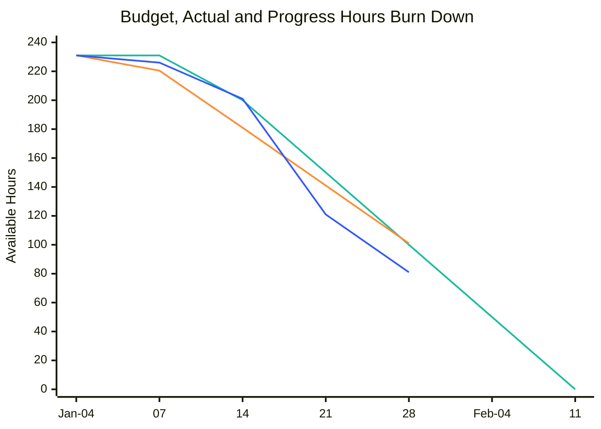

# Workflow, Project and Task Management

## Action items 

Incomplete **action items**, any action that must be completed, are reflected in the note body as `- [ ] action item description`.  Complete action items are reflected in the note body as `- [x] action item description`.

Comments, modifiers and results can be associated with an action item using the `<comments>` tag.  For example - 

```markdown
Things to do 
- [ ] update the readme file
<comments>
    Remember first draft needed more detail about how to find action items.
</comments>
- [ ] 2026-02-03 approve time sheets before cut off
- [x] 2026-02-03 start release preparation
<comments>
Done, dev manager reports that the release manager is prepared and ready for Thursday's release
</comments>
```
In the above example, the feedback about the release manager will be associated with the "start release preparation" action item.


## Finding Incomplete action items 

Use the `get-actionItems` command to return incomplete action items.

## Tasks

Use `project_tasks_from_CSV.py` to import tasks.

Tasks can be imported and updated from remote sources such as DevOps, Jira, Trello, etc using the `project_tasks_from_CSV.py` command.

Our project tasks expects a CSV file containing 
- ID: task unique identifier
- Title: human readable task name
- Status: 
- Start Date: 
- Due Date: date that the work item is expected to be completed
- Closed Date: date that the work item was completed
- Assigned To:
- Task Detail: human readable description of the task.


The following synonyms will be accepted for column names.

``` Python
"""Projects.py line 26, importTaskColumnTranslation

{"ID":["ID","Task Identifier","Task Identifier","Task ID","TaskID","Task Id","Task id","Task_Id","Ticket","Ticket Number"],
"Title":["Title","Task Name","Task","Task Title","Task_Title","Task_Name","Ticket Title","Ticket_Title"],
"Status":["State","Status","Task Status","Ticket Status","Ticket_Status"],
"Start Date":["Start Date","Task Start Date","Start_Date","Task_Start_Date","Ticket Start Date","Ticket_Start_Date"],
"Due Date":["Due Date","Task Due Date","Due_Date","Task_Due_Date","Ticket Due Date","Ticket_Due_Date"],
"Assigned To":["Assigned To","Task Assigned To","Assigned_To","Task_Assigned_To","Ticket Assigned To","Ticket_Assigned_To"],
"Closed Date":["Closed Date","Task Closed Date","Closed_Date","Task_Closed_Date","Ticket Closed Date","Ticket_Closed_Date"],
"Task Detail":["Task Detail","Task Details","Task_Detail","Task_Details","Ticket Detail","Ticket_Detail","Acceptance Criteria"],
}
```

On first import all of the columns are used to create a new task but on subsequent *update* events ID, Title and Task Detail will not be changed.


### Status and State

Status and state are highly dependant on the source system.  The following shows how states are translated to KanBan board columns.

``` Python
"""Projects.py line 87, def KanBanColumn(self)"""

if state in ["not started", "pending", "to do"]:
    return kanBanBoardColumns.get("To Do", "To Do")
elif state in ["in progress", "ongoing", "doing"]:
    return kanBanBoardColumns.get("In Progress", "In Progress")
elif state in [
    "completed",
    "done",
    "finished",
] or self.percentComplete >= Decimal("100"):
    return kanBanBoardColumns.get("Done", "Done")
elif state in ["cancelled", "canceled", "abandoned"]:
    return kanBanBoardColumns.get("Cancelled", "Cancelled")
else:
    return kanBanBoardColumns.get("Backlog", "Backlog")
```


# Burndown 

If the project folder contains a `data_burndown.csv` file then a burndown style visualization is possible.

## Columns

- x-axis: must include a date, or at least a year month in the format `YYYY-MM-DD`.
    - x-axis label will be displayed as MMM-DD for the first day of the month and then just DD to save space until the next month
- Planned Budget: float values for your planned burn down.  The first record should be the full budget, the last record should be zero.
- Actual: the actual hours reported, use zero to indicate that that the project hasn't reached that point yet
- Earned Value: the calculated earned value based on the team's progress report.  For example if your total budget is 200 hours and the team reports that the project is 70% your earned value for this visualization is *140*. 

### Example CSV
```csv 
x-axis,Planned Budget,Actual,Earned Value
2026-01-04,231,0,0 
2026-01-07,231,10.5,5
2026-01-14,200,50,30
2026-01-21,150,90,110
2026-01-28,100,130,150
2026-02-04,50,0,0
2026-02-11,0,0,0

```
<div style="font-size: x-small;">

| x-axis     |   Planned Budget |   Actual |   Earned Value |
|:-----------|-----------------:|---------:|---------------:|
| 2026-01-04 |              231 |      0   |              0 |
| 2026-01-07 |              231 |     10.5 |              5 |
| 2026-01-14 |              200 |     50   |             30 |
| 2026-01-21 |              150 |     90   |            110 |
| 2026-01-28 |              100 |    130   |            150 |
| 2026-02-04 |               50 |      0   |              0 |
| 2026-02-11 |                0 |      0   |              0 |

</div>

### Example visualization

<div style="break-after: page;"></div>



<span style="color: #1ABC9C; font-size: 10px">budget</span> - <span style="color: #FF8C33; font-size: 10px">Actual</span> - <span style="color: #3357FF; font-size: 10px">earned value (progress hours)</span>

<div style="break-after: page;"></div>

# Project Configuration

Each project has a `.ProjectConfig.json` file that contains the project configuration. 

```json
{
    "ProjectFolderName": "Physical Folder Name",
    "ProjectName": "Common or Display Name for the project",
    "Programs": ["List of the Programs that this project is associated with", "Typically many Projects combine to make a Program"],
    "Archived": "Boolean value to indicate if the project is archived or active.  Archived projects are not included in the search or add note features.  Archived projects can be 'reactivated' by changing this value to false.",
    "Sync": "Boolean value to indicate if the project should be included in the sync process.  If false, the project will not be included in the search or add note features.  This is useful for projects that are still in development or for projects that are not yet ready to be shared with the team.",
    "PublicShareFolder": "Path to the folder where raw markdown files will be shared.  Typically this is a shared network drive, OneDrive, SharePoint, iCloud, etc. location that is accessible to the team.  If this value is not set, then notes will not be shared.",
    "PublicPublishFolder": "Path to the folder where published PDF files will be shared.  Typically this is a shared network drive, OneDrive, SharePoint, iCloud, etc. location that is accessible to the team.  If this value is not set, then notes will not be published.
    
    This value should be the root for the project.  For example if your project is 'Project A' then this value should be the path to the folder that contains the 'Project A' folder.  The published PDF files will be shared in a subfolder of this location with the same name as the project.  For example if all of your projects share the same root folder '/Obsidian/Shared/Projects/' manually make a sub folder 'Project A' for this value so you see '/Obsidian/Shared/Projects/Project A'. 

    ",
    "Needs Weekly Progress Update": "Boolean value to indicate if the project requires a weekly progress update.  This is used to determine if the project should be included in the weekly progress update report.",
    "Needs Monthly Progress Update": "Boolean value to indicate if the project requires a monthly progress update.  This is used to determine if the project should be included in the monthly progress update report.",
}
```

## Sharing Project Content

Consider a situation where you have a project that is being worked on by a team of people.  You want to use your personal knowledge vault to take notes and manage the project but you also want to share *some* of those notes with the team.  You can use the `PublicShareFolder` configuration value to specify a shared location where the raw markdown files will be copied to.  

This allows the team to access the notes in their native format and use them in their own tools if they choose to do so.  If the `PublicShareFolder` value is not set, then the notes will not be shared and will only be available in your personal knowledge vault.

By design the `PublicShareFolder` folder must specify the full path, not a root folder with a sub folder for each of your projects.  This is done to give you flexibility if you are working with multiple teams or have a sync folder naming convention that does not end in the project name.  For example, you may have a root folder for all of your projects at '/Obsidian/Shared/Projects/' but you want to specify a sub folder for each project such as '/Obsidian/Shared/Projects/Project A' and '/Obsidian/Shared/Projects/Project B'.  This also allows you to share notes from the same project in different folders if needed.  For example, you may want to share some notes with the team in one folder and share other notes with a different team in another folder.


