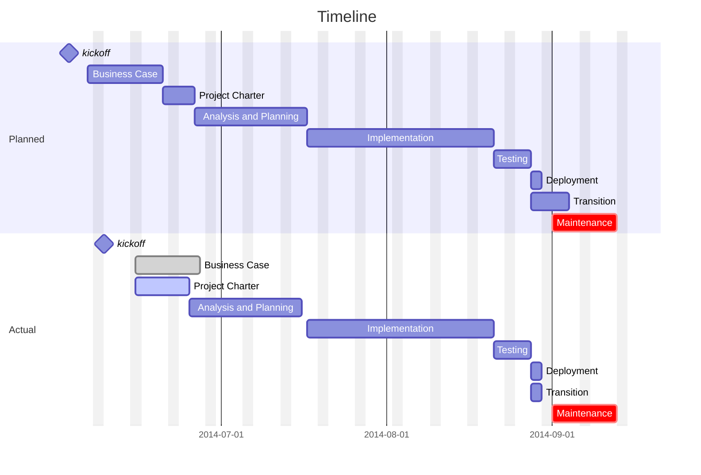

# [Project Name] 

## Authorization

**Business Sponsor:**

**Project Manager:**

**Team Resources:**

## Executive Summary

**Business Need:**

**Objectives:**

**Success Criteria:**

## Scope

### In Scope:

### Out of Scope:

## Stakeholders

<!--Start_Stakeholders-->

<!--End_Stakeholders-->

---

<!-- Hidden hints
Position vs. Role: Position is usually a job title, role is the stakeholder's role in the project.

Roles:
    Project Sponsor: The person or group who provides the resources and financial support for the project.
    Stakeholders: Individuals, groups, or organizations who may affect, be affected by, or perceive themselves to be affected by a decision, activity, or outcome of a project.
    Project Team Members: Individuals who report directly to the Project Manager and perform the work necessary to produce the project's deliverables.
    Functional Manager: The person who has management authority over an organizational unit (like an IT or marketing department) and is often the one who assigns staff to the project team.

Classification: 
	- high power, high influence - manage closely
	- high power, low influence - keep satisfied
	- low power, high influence - keep informed
	- low power, low influence - not prioritized

-->

<!-- Hidden Section

### Glossary of Common Terms

- term 1
- term 2

-->

## Schedule

**Start Date:**

**Projected Completion Date:**

**Actual Completion Date:**

## Budget

**Budget Amount:** $1000.00

**Budget Hours:** 40

**Contingency:** 10%

**Actual Hours:** tbd

**Time Tracker Code:** tbd

<!--Start_BurnDown-->

<!--End_BurnDown-->

---

# Milestones:

<!-- hidden mermaid example

-->

# Transition Plan

<!-- hidden mermaid example

- Document and Transfer Knowledge/Assets
- Execute the Handover / Cut over
- Evaluate and Ensure Ongoing Value Realization

-->

# RAID

## Risks

| Risk ID | Description | Owner | Status | Date | Action Required | Priority |
|---------|-------------|-------|--------|------|------------------|----------|
|         |             |       |        |      |                  |          |

---

## Assumptions

| Assumption ID | Description | Owner | Status | Date |
|---------------|-------------|-------|--------|------|
|               |             |       |        |      |

---

## Issues

| Issue ID | Description | Owner | Status | Date | Impact | Resolution |
|----------|-------------|-------|--------|------|--------|-------------|
|          |             |       |        |      |        |             |

---

## Dependencies

| Dependency ID | Description | Owner | Status | Due Date | Impact Level |
|----------------|-------------|-------|--------|-----------|---------------|
|                |             |       |        |           |               |

---
 