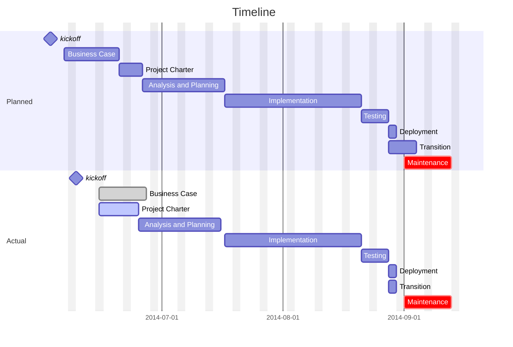

## Milestones:

<!--Start_milestones-->

<!-- hidden mermaid example

```mermaid
gantt
    title       Timeline
    dateFormat  YYYY-MM-DD
    tickInterval 1month
    excludes    weekends
    
    section Planned
    kickoff                             :milestone, kickoff, 2014-06-02, 1d
    Business Case                       :p1, 2014-06-06, 10d
    Project Charter                     :p2, after p1, 4d
    Analysis and Planning               :p3, after p2, 15d
    Implementation                      :p4, after p3, 25d
    Testing                             :p5, after p4, 5d
    Deployment                          :p6, after p5, 2d
    Transition                          :p7, after p5, 5d
    Maintenance                         :crit,p7, after p6, 10d

    section Actual
    kickoff                             :milestone, kickoff, 2014-06-02, 10d
    Business Case                       :done, a1, 2014-06-15, 10d
    Project Charter                     :active, 2014-06-15, 2014-06-25
    Analysis and Planning               :a3, 2014-06-25, 15d
    Implementation                      :a4, after p3, 25d
    Testing                             :a5, after p4, 5d
    Deployment                          :a6, after p5, 2d
    Transition                          :a7, after p5, 2d
    Maintenance                         :crit,p7, after p6, 10d


```
-->

<!--End_milestones-->
